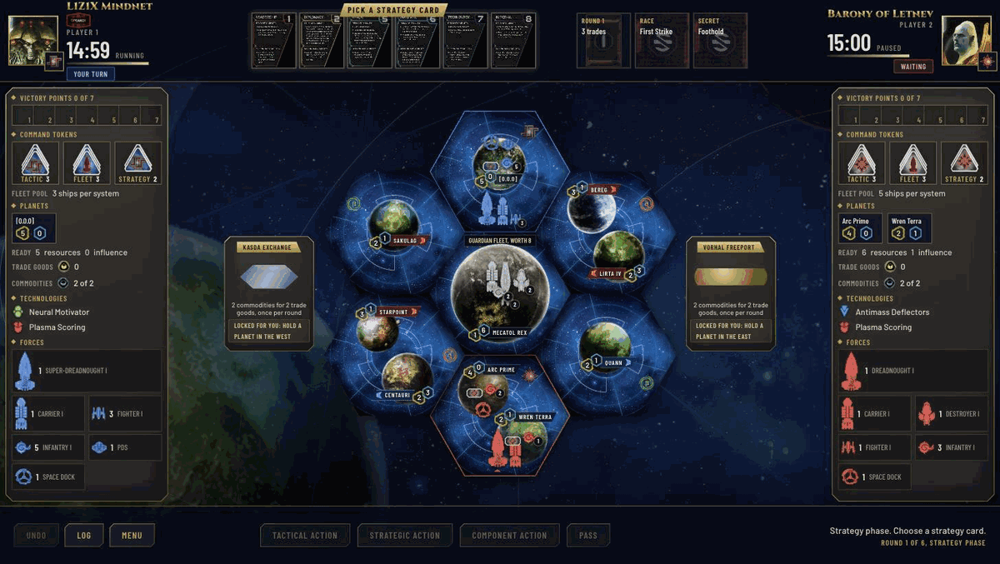
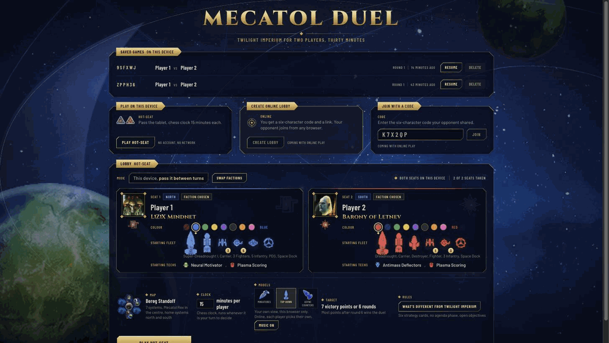

# Mecatol Duel

A two-player distillation of *Twilight Imperium 4*, played in a browser. Seven hexes, two factions, a chess
clock, about thirty minutes. The rules are the real ones wherever they fit two players and a short evening,
and the pieces are the real miniatures, rendered.

**Play it: [mecatol-duel.vercel.app](https://mecatol-duel.vercel.app)**



## The game

L1Z1X Mindnet in the north against the Barony of Letnev in the south, with Mecatol Rex in the middle behind a
neutral guardian fleet. Both sides start with their printed fleet, their printed technologies and their own
home planets.

A round runs the way it does in Twilight Imperium:

1. **Strategy phase.** A snake draft over six strategy cards. Cards nobody takes collect a trade good and
   pay it to whoever picks them up next round.
2. **Action phase.** Players alternate. A turn is one tactical action, one strategic action, one component
   action, or a pass. A tactical action activates a system, moves ships into it, fights, invades and
   produces, in that order.
3. **Status phase.** Score what you fulfilled, hand out command tokens, ready your planets, reveal the next
   objective.

Seven victory points win it. If nobody gets there, the higher score after round six does.

**Victory points come from** a shuffled pool of five public objectives, one revealed per round, plus two
cards that are in play from the first round: *First Strike*, a race for a single point that goes to whoever
first wins a space combat at Mecatol Rex, and *Foothold*, the secret both players hold, worth a point for
taking a planet in the opponent's home system. Holding Mecatol Rex is worth a point in every status phase.

**What is cut:** action cards, promissory notes, the agenda phase and secret objectives. **What is added:**
neutral trade posts outside the map that turn commodities into trade goods, an emergency shipyard, and a
guardian fleet on Mecatol Rex worth eight resources that has to be beaten before the centre is anyone's.

The complete rules are in [`docs/spec/game-rules.md`](docs/spec/game-rules.md), and the game itself has a
rules page under the menu.

## Playing



- **Hot-seat** on one device: pass the tablet, the clock changes hands with it.
- **Saved games** live in the browser, several at a time, each under a six-character code.
- **Unit art** is the viewer's own choice: the miniatures at a three quarter angle, the same models seen
  straight from above, or the flat Async TI counters. Online, each player picks their own.
- **A soundtrack** of three tracks in rotation, switched off in the lobby or in the game menu.
- Online play over a shared code is specified in [`docs/spec/online-play.md`](docs/spec/online-play.md) and
  is the next thing being built.

## How it is built

The rules live in a pure TypeScript engine that knows nothing about React, the DOM or time. Everything the
interface can do goes through two functions:

```ts
legalMoves(state)            // every move that is legal right now
applyMove(state, move, seed) // a new state, or an error explaining the refusal
```

That shape is what makes the game testable and what will make it safe over a network: the interface never
decides what is allowed, it only offers what the engine already listed. Randomness is seeded and every die
roll is logged, so a game replays from its own move log, and the same seed always produces the same map, the
same guardian fleet and the same objective order.

| Path | What is in it |
| --- | --- |
| `src/engine/` | The rules: movement, combat, invasion, production, strategy cards, objectives, phases |
| `src/data/` | The map, the factions, the units, the technology tree, the objectives, the trade posts |
| `src/ui/` | React on top: board, panels, flows, lobby, persistence |
| `docs/spec/` | The binding specification the engine is written against |
| `tools/render/` | The renderer that turns the 3D models into the sprite sets |

## Development

```bash
npm install
npm run dev      # the game on localhost
npm test         # the whole suite
npm run lint     # oxlint
npx tsc -p tsconfig.app.json --noEmit
```

Rules for every change are in [`CLAUDE.md`](CLAUDE.md). The short version: small commits, one per logical
step, conventional messages in English, and `npm test`, the type check and the lint clean before anything
that touches `src/` is committed. The specification in `docs/spec/` is the authority; when a rule changes,
it changes there first.

Pushing to `main` deploys to Vercel.

## Credits

A fan project, not affiliated with anyone. *Twilight Imperium* and its artwork belong to Fantasy Flight
Games. Unit, tile and card images come from the [AsyncTI4 map generator](https://github.com/AsyncTI4/TI4_map_generator_bot),
the 3D unit models from the Tabletop Playground community port, and the music is by Kevin MacLeod
(incompetech.com), licensed under Creative Commons By Attribution 4.0. Full music credits are in
[`public/audio/CREDITS.md`](public/audio/CREDITS.md).
